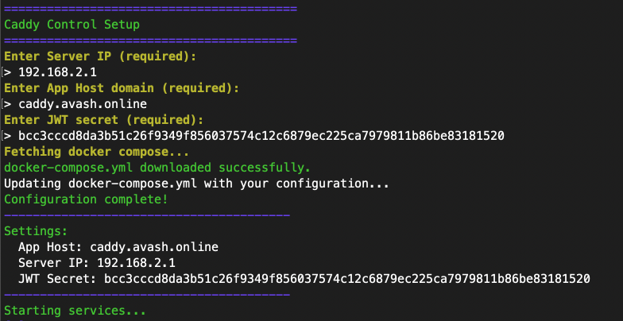

<p align="center">
  
</p>

<p align="center" style="margin-top: 20px">
  <strong>Caddy Control</strong> - Open Source Domain Routing Control Service
</p>

## About this project

This project was born out of the need to build a custom domain service with automated SSL management tailored for white-label SaaS platforms. There are managed services like Approximated, SaaS Custom Domains, etc., but limited open-source, self-hosted alternatives that provide a reliable experience. Leveraging Caddy, this project provides a way to programmatically integrate 'bring your own domain' features into SaaS products, as well as manage proxies for regular routing needs.

## Features

- [x] Rest API Access
- [x] Proxy management dashboard
- [x] API Keys management dashboard
- [ ] Domain redirection option
- [ ] Multi user support

## Tech Stack

- [Next.js](https://nextjs.org/) - Framework
- [Caddy](https://caddyserver.com/) - Proxy Server
- [Prisma](https://www.prisma.io/) - ORM
- [Tailwind](https://tailwindcss.com/) - CSS
- [shadcn/ui](https://ui.shadcn.com/) - Component Library

## Local Development

To run caddy control locally, you will need to setup the following:

- [Caddy](https://caddyserver.com/docs/install) - Recommended to run using the included development docker compose file.
- [Docker](https://docs.docker.com/engine/install/) - Recommended but not mandatory.

**Recommended**: Run the caddy server docker image locally using the following command: <br>

> pnpm dev:caddy

It uses the `docker-compose.dev.yml` compose file to start a local instance of caddy server.

Once the required setup is done, run the following commands to start caddy control locally.

1. Clone the repository

```bash
git clone https://github.com/avashForReal/caddy-control.git
```

2. Create a .env file with the following content.

```bash
APP_HOST=<YOUR-APP_DOMAIN>
CADDY_SERVER_IP=localhost
CADDY_ADMIN_URL=http://localhost:2019
JWT_SECRET="awesomesecret"
```

**Description:** <br>
<strong>APP_HOST</strong>: Not relevant for local development. <br>
<strong>CADDY_SERVER_IP</strong>: IP of the caddy server. If you are using a remote server then put the public IP of the server.<br>
<strong>CADDY_ADMIN_URL</strong>: URL of the caddy admin API. If you are using a remote server then put the public IP of the server.<br>
<strong>JWT_SECRET</strong>: JWT token secret.<br>

3. Install Dependencies

```bash
pnpm install
```

4. Start development server

```bash
pnpm dev
```

The first user will me seeded with `admin` username and `admin` password and will be prompted to change password after first login.

## Self Hosting Using Docker

End-to-end guide on how to self-host caddy control.

### Prerequisites

To self host you will need:

- A server with public a IP. Make sure to expose the ports `80` and `443` for incoming traffic.
- [Docker](https://docs.docker.com/engine/install/) installed in your server.

Run the following script to get up and running using docker.

```bash
bash -c "$(curl -sSL https://raw.githubusercontent.com/avashForReal/caddy-control/refs/heads/main/deploy.sh)"
```



Make sure to create an `A record` for the provided `App Host Domain` pointing to `Caddy Server IP`. Caddy control will be available at the provided `App Host Domain`.

After the setup is complete, first user with following credentials will be created:

```bash
username: admin
password: admin
```

This user will be prompted for password change in their first login.

## API Documentation

### Authentication

- All API requests must include an `x-api-key` header.

## Endpoints

### Add Domain

**Endpoint:** `/api/domains` <br>
**Method:** `POST` <br>
**Headers:** `{ "x-api-key": "your_api_key" }` <br>
**Request Body:**

```json
{
  "incomingAddress": "yourdomain.com",
  "destinationAddress": "backend.com",
  "port": 8080,
  "enableHttps": true
}
```

<br>

**Description:**

- `incomingAddress`: The domain name that users will access. This must be a valid domain (e.g., abc.mywhitelabledomain.com). This domain also should have an `A record` pointing to the IP address of server where caddy control is running.
- `destinationAddress`: The backend server where requests should be routed. This must also be a valid domain (e.g., customer.saasprovider.com).
- `port`: The port number of the backend server that will handle incoming traffic (e.g., 8080). If the desination has SSL enabled then this should probably be set to `443`.
- `enableHttps` (optional): Determines whether HTTPS should be enabled for the domain. Defaults to true if not provided.

**Response:**

```json
{ "message": "Domain added successfully!" }
```

### Get Caddy Configuration

**Endpoint:** `/api/caddy/config` <br>
**Method:** `GET` <br>
**Headers:** `{ "x-api-key": "your_api_key" }` <br>
**Response:**

```json
{
  "config": {
    /* Caddy Configuration */
  }
}
```

### Get Registered Domains

**Endpoint:** `/api/domains` <br>
**Method:** `GET` <br>
**Headers:** `{ "x-api-key": "your_api_key" }` <br>
**Response:**

```json
{
  "data": [
    {
      "id": "cm8o9l9d50001sy2uorjt2wua",
      "incomingAddress": "demo.incomingaddress.com",
      "destinationAddress": "xyz.destination.com",
      "port": 443,
      "isLocked": false,
      "enableHttps": true,
      "createdAt": "2025-03-25T08:59:25.481Z",
      "checkResults": {
        "dnsCheck": {
          "result": false,
          "description": "Domain does not resolve to proxy IP."
        },
        "proxyReachability": {
          "result": false,
          "description": "Requests do not reach the proxy."
        }
      }
    }
  ],
  "total": 1
}
```

### Delete Domain

**Endpoint:** `/api/domains` <br>
**Method:** `DELETE` <br>
**Headers:** `{ "x-api-key": "your_api_key" }` <br>
**Request Body:**

```json
{ "incomingAddress": "yourdomain.com" }
```

**Description:**

- `incomingAddress`: The domain address that you want to delete.

**Response:**

```json
{ "message": "Domain deleted successfully!" }
```

### Error Handling

Responses follow this format:

```json
{
  "error": "Error message",
  "details": [
    /* Validation errors */
  ]
}
```

## License

MIT
